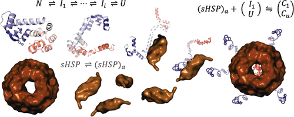
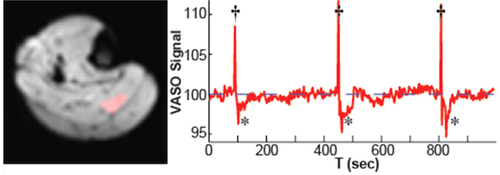

### Hi there 👋

- 🔭 I’m currently working on ...
  - A Kaggle NLP project
  - Improving an anomaly detection algorithm for ECGs using LSTMs

- 🌱 I’m currently learning ...
  - PySpark
  - Keras
  - TensorFlow
  - PyTorch
### About Me

I am a data scientist, technical communication specialist, Army veteran, and music lover. I'm committed to helping you tell your story with compelling supporting data. I help businesses sift through the noise to discover what metrics really matter and how to improve them maximizing efficiency and minimizing discomfort.

I was a Signals Intelligence Sergeant in the Army for six years, ending up as the Noncommissioned Officer in Charge of Signals Intelligence and Electronic Warfare for U.S. Army South, where I supervised a team to intercept, decrypt, analyze, and report foreign communications in both strategic and tactical settings. We worked to identify trends, forecast outcomes, and provide predictive analysis to drive operations in fast-paced, challenging environments.

I developed, optimized, and wrote standard operating procedures for the team and developed novel, automated data-processing techniques eliminating manual data entry from previously incompatible systems freeing up more time for analysis and increasing data fidelity.

After the Army, I pursued graduate studies in Molecular Physiology & Biophysics at the Vanderbilt University Medical Center, where I independently designed, executed, and performed quantitative statistical analysis of experiments related to human health and disease. I though classes at the undergraduate and graduate levels. I designed novel MRI techniques and conducted human trials in a clinical research setting. I authored and published a manuscript in the peer-reviewed journal *Biochemistry*, which has been cited over 275 times.

As much as I enjoyed "doing science," I discovered I enjoy telling stories with data even more. I enjoy data analysis and technical communication.

I have edited and provided figures for articles published in *The Biophysical Journal*, the *Journal of Molecular Biology*, the *Journal of Biological Chemistry*, and *Science*. Twenty-eight of the of the twenty-nine grant applications I wrote or edited were funded for over $7,000,000.

I expanded my data analysis toolkit to approach problems in a more programatic manner with python and other data science libraries with artificial intelligence and machine learning techniques. Am looking forward to continuing my longstanding search for truth within data using these tools.

---

## Stats

  

  
---

### Skills

Python - SQL - Tableau - Applied Statistics - Pandas -
Matplotlib - Seaborn - Plotly - Machine Learning - Natural Language Processing - Apache Spark - Data Storytelling - Git - Jupyter Notebooks - Prophet - Anaconda - Adobe CS (Illustrator, In Design, Photoshop) - Matlab - Origin - Windows - Mac OS - UNIX / Linux

---

### Achievements

- **Army Commendation Medal** Data Engineering
"Sergeant Godar developed a new automated single source database as well as the tactics, techniques, and procedures for operation which free dip time normally spent manually imputing data allowing more time for data analysis. Soldier's input, hard work, and expertise had a major impact on the section's ability to achieve its goals."

- **Army Achievement Medal** (Second Award) for
meritorious service as an intelligence analyst. Sergeant Godar's professionalism and technical competence significantly contributed to the successful and safe execution of missions throughtout the Southern Command.”

- **American Red Cross Certificate of Merit** the highest award issued by the Red Cross for saving life.

- **Eagle Scout**

---

### Publications

- [Structure and Mechanism of Protein Stability Sensors: Chaperone Activity of Small Heat Shock Proteins](https://pubs.acs.org/doi/abs/10.1021/bi900212j) *Biochemistry* (Cited by 273 as of Feb 2020)

- [Imaging of muscle blood volume changes during exercise with Vascular Space Occupancy (VASO) MRI](https://faseb.onlinelibrary.wiley.com/doi/full/10.1096/fasebj.26.1_supplement.lb778) *The FASEB Journal* 

---

### Memberships

- International Society for Magnetic Resonance in Medicine
- Federation of American Societies for Experimental Biology
- American Medical Writers Association
- Project Management Institute
- American Legion
- Veterans of Foreign Wars

---

### Links

<!----!>

<!--
**Jared-Godar/Jared-Godar** is a ✨ _special_ ✨ repository because its `README.md` (this file) appears on your GitHub profile.

Here are some ideas to get you started:

- 🔭 I’m currently working on ...
- 🌱 I’m currently learning ...
- 👯 I’m looking to collaborate on ...
- 🤔 I’m looking for help with ...
- 💬 Ask me about ...
- 📫 How to reach me: ...
- 😄 Pronouns: ...
- ⚡ Fun fact: ...
-->
